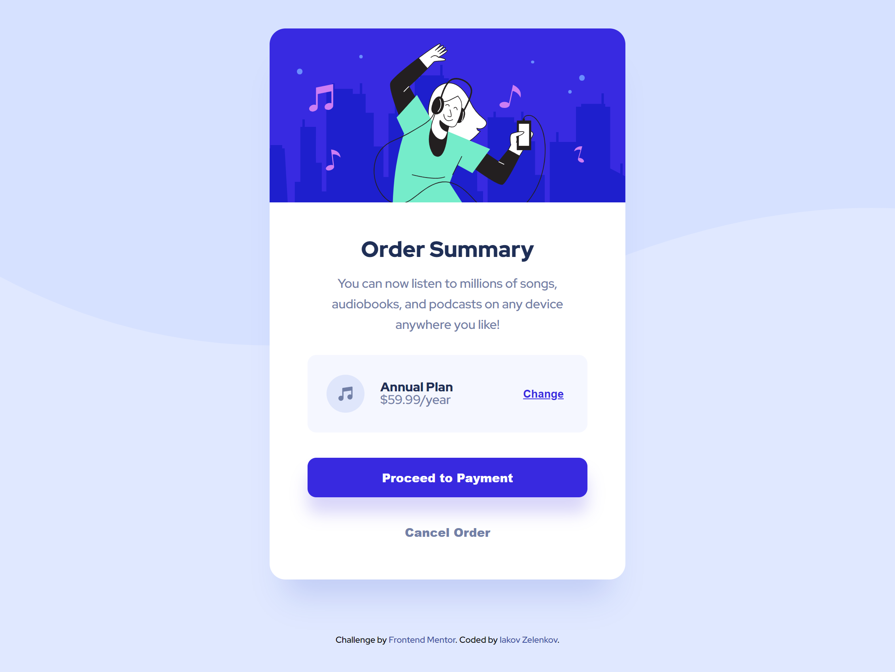

# Frontend Mentor - Order summary card solution

This is a solution to the [Order summary card challenge on Frontend Mentor](https://www.frontendmentor.io/challenges/order-summary-component-QlPmajDUj). Frontend Mentor challenges help you improve your coding skills by building realistic projects.

## Table of contents

- [Overview](#overview)
  - [The challenge](#the-challenge)
  - [Screenshot](#screenshot)
  - [Links](#links)
  - [Built with](#built-with)
- [Author](#author)

## Overview

### The challenge

Users should be able to:

- See hover states for interactive elements

### Screenshot

### Links

- Solution URL: https://www.frontendmentor.io/solutions/order-summary-card-xcmoakD5v
- Live Site URL: https://iakov-zelenkov-order-summary.netlify.app/

### Built with

- Semantic HTML5 markup
- CSS custom properties
- Flexbox
- SASS Preprocessor
- Mobile-first workflow

## Author

- Website - [Iakov Zelenkov](https://github.com/IakovZelenkov)
- Frontend Mentor - [@IakovZelenkov](https://www.frontendmentor.io/profile/IakovZelenkov)
